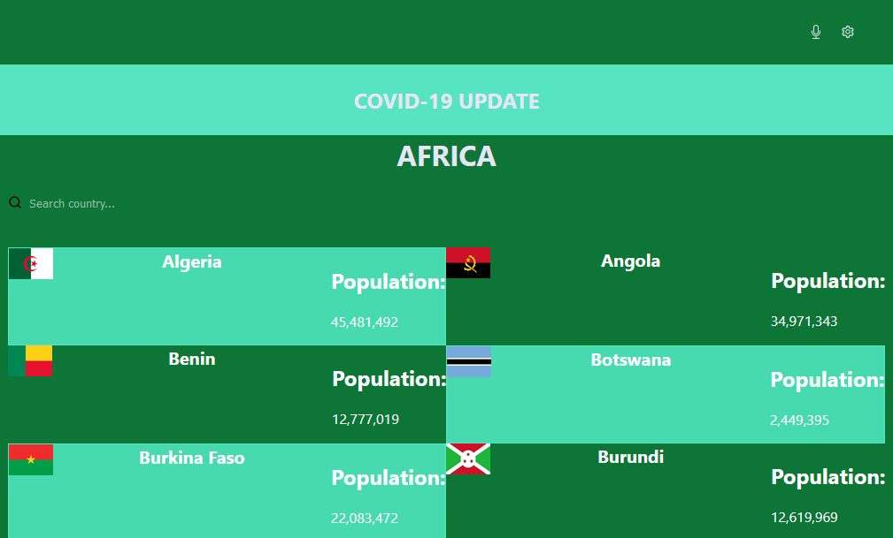

## Web-App
A Covid-19 data application that displays updates on the disease in countries of Africa. The disease updates is fetched from [here](https://disease.sh/v3/covid-19/countries). 

- This project was bootstraped with [Create React App](https://github.com/facebook/create-react-app)

## Built With

- HTML - CSS - Javascript
- React
- Redux
- Github

- You may also see any lint errors in the console.

## Preview


## In the project directory, you can run:

 [Presentation](coming soon)

## Live Link

[Click here]()

### Setup
~~~ 
git clone https://github.com/Smart1-hub/webapp
cd webapp

~~~
- install project dependencies
```
npm install
```
- start project
```
npm start
```
- run test
```
npm test
```
## Environment Prerequisites

Web Browser

Code editor: Vscode or any other code editor

## Authors

👤 **Ademola Adebayo**

- Github: [@Smart1-hub](https://github.com/Smart1-hub)

- Twitter: [@ademola_adebayo](https://twitter.com/ademola_adebayo)

- LinkedIn: [Ademola Adebayo](https://www.linkedin.com/in/ademola-adebayo-81051578/)

## Acknowledgement

- You can also learn more in the [Create React App](https://facebook.github.io/create-react-app/docs/getting-started)

- Original design idea is by Nelson Sakwa in [Behance](https://www.behance.net/gallery/31579789/Ballhead-App-(Free-PSDs))

## Contributing

Contributions, issues, and feature requests are welcome!

## Show your support

Give a ⭐ if you like this project and how it is built!

## 📝 License

This project is [MIT](https://github.com/microverseinc/readme-template/blob/master/MIT.md) licensed.